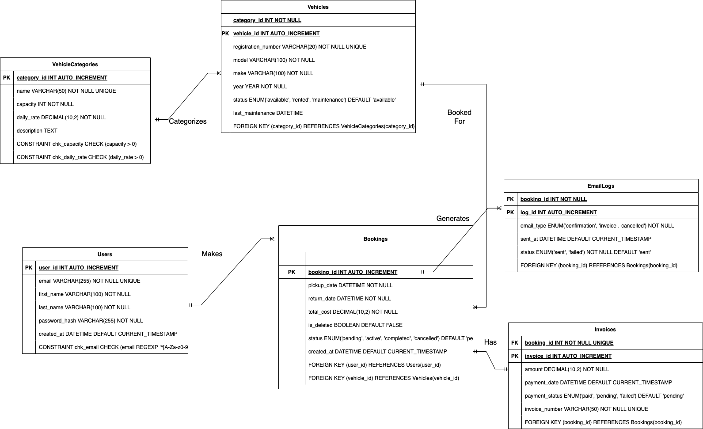

# Vehicle_Rental Microservice

This vehicle rental microservice was built using Python 3.12 but has not been tested with other versions. 

The car rental project utilizes a Flask-based RESTful API architecture, interfacing with a MySQL database through a  Database class that implements connection pooling for efficient resource management. The project follows a layered architecture, separating concerns into repository, service, and API route layers. Key entities such as Users, Vehicles, and Bookings are modeled with their own classes and database tables. The system incorporates error handling and logging mechanisms throughout its components to ensure easier debugging. Design decisions include the use of the Repository pattern for data access, Service layer for business logic, and DTO (Data Transfer Object) pattern for data validation and transformation. The API endpoints are designed to handle CRUD operations for bookings, user management, and vehicle inventory, with additional features like daily reporting and vehicle availability checks. 

To enhance my car rental API's performance, I plan to implement a few optimizations. Ideally, I would like to write more integration tests that are able to automate the manual testing of testing the application. I would also add caching for frequently accessed data, like vehicle availability, using Redis to reduce database load which should help as more data is added to the database. I'll also optimize my database queries for reports by adding appropriate indexes where there are bottlenecks. Finally, I would like to set up asynchronous processing for non-critical tasks like email notifications to speed up the main request-response cycle. 

## ERD Diagram

## Instructions

To use the Car Rental microservice, first change into the API directory.

`cd API`

 Create a virtual environment:

 `python3 -m venv venv`

 Activate the virtual environment:

 `source venv/bin/activate`

 Upgrade pip:

 `pip install --upgrade pip`

 Install the requirements:

`pip install -r requirements.txt` 

## MySQL Notes

Ensure MySQL is available on you workstation. 
If not install the latest version. 

Run the MySQL script to create the database and tables.

`python initialize_schema.py`

I created a script that pre populates the database with information to prevent
foreign key errors since they are required to create bookings. To run this script:

`python db_populate.py`

Run the server:

`python app.py`

## Logging and Error Responses

I decided to incorporate logging in my repository files as a best practice for error handling and system monitoring. This approach allows me to capture detailed information about errors and system operations without exposing sensitive data or technical details to the client. 

## Testing

To run unit tests ensure you have an active virtual environment in the API directory 
with the required dependencies. To run the tests:

`python -m unittest discover tests`

For more detailed readout use the -v flag. 

`python -m unittest discover tests -v`

Manual testing was performed to ensure that create/update/delete functionality for bookings was working. I can send 
my manual tests if requested. 

# Car Rental API Project Checklist

## Database Design and Implementation
- [x] Create an ERD diagram of the MySQL schema
- [x] Implement SQL for database schema
  - [x] Include all required foreign keys
  - [x] Add necessary constraints
  - [x] Create appropriate indexes
  - [x] Implement check constraints

## Python Flask Application
- [x] Set up a working Flask application
- [x] Establish connection to MySQL database

### API Endpoints
#### User Operations
- [x] Implement CREATE user endpoint
- [x] Implement READ user endpoint
- [x] Implement UPDATE user endpoint
- [x] Implement DELETE user endpoint

#### Vehicle Operations
- [x] Create endpoint to check availability/status of a particular vehicle
- [x] Create endpoint to check availability/status of a type of vehicles

#### Reporting
- [x] Implement daily report endpoint for bookings

